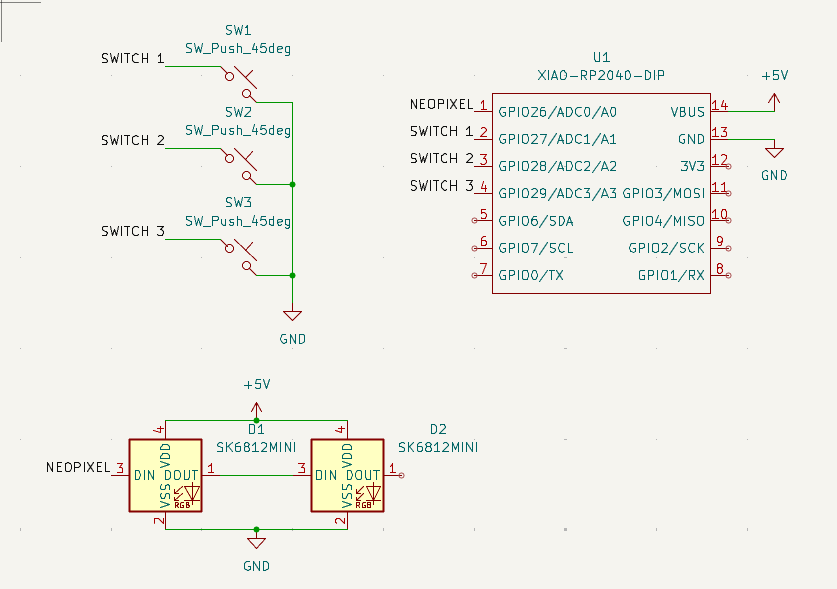
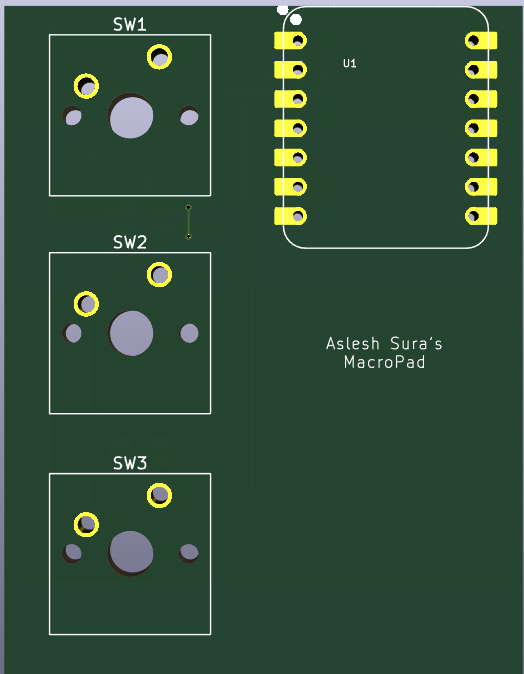
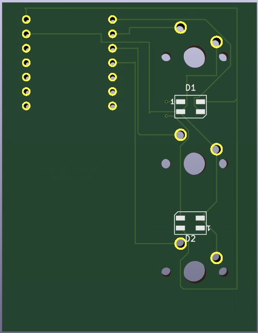
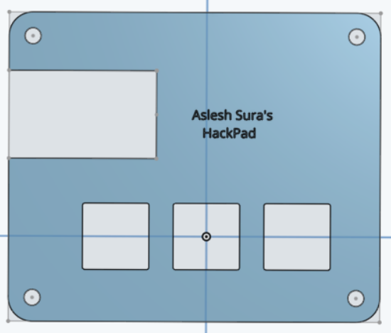
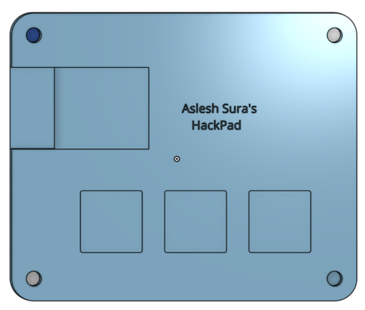
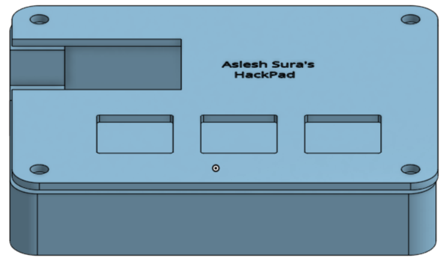

# Hackpad

A fully custom DIY macropad, designed from the PCB up. This repository contains the finalized blueprints, design files, and firmware for a 3-key programmable macropad built using the XIAO RP2040 microcontroller and KMK firmware.

---

## 📁 Repository Contents

- `pcb/` – KiCAD project files including schematic, layout, and 3D models
- `case/` – Fusion 360 design files for the case (STEP & F3D format)
- `firmware/` – `main.py` and KMK setup for the macropad
- `resources/` – Reference images, dimension drawings, and DXF cutouts
- `README.md` – You are here.

---

## ✅ Features

- 3 hot-swappable mechanical keys
- RGB underglow (SK6812 Mini)
- USB-C via XIAO RP2040
- Fully customizable KMK firmware
- OpenSCAD/Fusion-compatible 3D case

---

## 🔩 Bill of Materials (BOM)

| Qty | Component                 | Part Number / Notes                          |
|-----|---------------------------|----------------------------------------------|
| 1   | XIAO RP2040               | Seeed Studio SKU 102010428                   |
| 3   | Mechanical Key Switches   | Cherry MX / Gateron / Kailh / your choice    |
| 3   | Keycaps                   | MX-compatible                                |
| 3   | 1N4148 Diodes (if needed) | For switch matrix (optional)                 |
| 2   | SK6812 MINI RGB LEDs      | 3535 RGB, WS2812-compatible                  |
| 1   | Custom PCB                | Generated via KiCAD                          |
| 1   | Case (Top & Bottom)       | 3D Printed or CNC machined                   |
| 4   | M2 Screws & Standoffs     | For case mounting                            |
| 1   | USB-C Cable               | For power and data                           |

---

## ⚙️ Flashing Firmware

1. Hold `BOOT` and press `RESET` on XIAO to enter UF2 mode.
2. Copy CircuitPython UF2 to the board.
3. Copy `KMK/`, `boot.py`, and `main.py` to the board.
4. Macropad is ready to use!

---

# IMAGES!!!

## Schematic

## PCB

PCB Top

PCB Bottom

## Case

Top Layer

Base

Case Top

Case Side

---

The End!